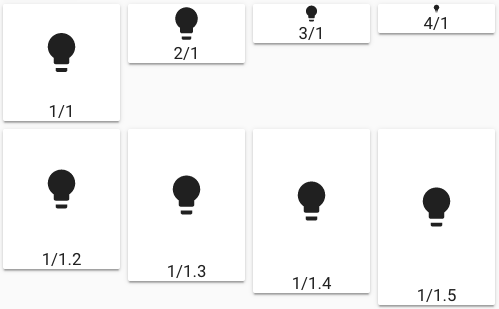

You can define the aspect ratio of the card.

!!! info

    This is not compatible with `section_mode: true`.



```yaml
- type: vertical-stack
  cards:
    - type: horizontal-stack
      cards:
        - type: custom:button-card
          name: 1/1
          icon: mdi:lightbulb
          aspect_ratio: 1/1
        - type: custom:button-card
          name: 2/1
          icon: mdi:lightbulb
          aspect_ratio: 2/1
        - type: custom:button-card
          name: 3/1
          icon: mdi:lightbulb
          aspect_ratio: 3/1
        - type: custom:button-card
          name: 4/1
          icon: mdi:lightbulb
          aspect_ratio: 4/1
    - type: horizontal-stack
      cards:
        - type: custom:button-card
          name: 1/1.2
          icon: mdi:lightbulb
          aspect_ratio: 1/1.2
        - type: custom:button-card
          name: 1/1.3
          icon: mdi:lightbulb
          aspect_ratio: 1/1.3
        - type: custom:button-card
          name: 1/1.4
          icon: mdi:lightbulb
          aspect_ratio: 1/1.4
        - type: custom:button-card
          name: 1/1.5
          icon: mdi:lightbulb
          aspect_ratio: 1/1.5
```
