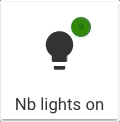
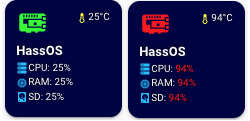
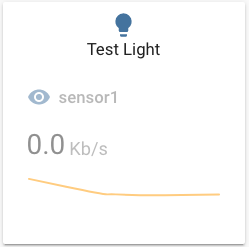

## General configuration

Custom fields support, using the `custom_fields` object, enables you to create your own fields on top of the pre-defined ones (name, state, label and icon). This is an advanced feature which leverages (if you require it) the CSS Grid.

Custom fields also support embeded cards, see [example below](#nested-card).

Each custom field supports its own styling config, the name needs to match between both objects needs to match:

```yaml
type: custom:button-card
[...]
custom_fields:
  test_element: My test element
styles:
  custom_fields:
    test_element:
      - color: red
      - font-size: 13px
```

Examples are better than a long text, so here you go:

## Absolute element positioning

Placing an element wherever you want (that means bypassing the grid). Set the grid to `position: relative` and set the element to `position: absolute`



```yaml
type: custom:button-card
icon: mdi:lightbulb
aspect_ratio: 1/1
name: Nb lights on
styles:
  grid:
    - position: relative
  custom_fields:
    notification:
      - background-color: |
          [[[
            if (states['input_number.test'].state == 0)
              return "green";
            return "red";
          ]]]
      - border-radius: 50%
      - position: absolute
      - left: 60%
      - top: 10%
      - height: 20px
      - width: 20px
      - font-size: 8px
      - line-height: 20px
custom_fields:
  notification: |
    [[[ return Math.floor(states['input_number.test'].state / 10) ]]]
```

## Using `grid-template-areas`

Or you can use the grid. Each element will have it's name positioned as the `grid-area`:



```yaml
type: custom:button-card
entity: 'sensor.raspi_temp'
icon: 'mdi:raspberry-pi'
aspect_ratio: 1/1
name: HassOS
styles:
  card:
    - background-color: '#000044'
    - border-radius: 10%
    - padding: 10%
    - color: ivory
    - font-size: 10px
    - text-shadow: 0px 0px 5px black
    - text-transform: capitalize
  grid:
    - grid-template-areas: '"i temp" "n n" "cpu cpu" "ram ram" "sd sd"'
    - grid-template-columns: 1fr 1fr
    - grid-template-rows: 1fr min-content min-content min-content min-content
  name:
    - font-weight: bold
    - font-size: 13px
    - color: white
    - align-self: middle
    - justify-self: start
    - padding-bottom: 4px
  img_cell:
    - justify-content: start
    - align-items: start
    - margin: none
  icon:
    - color: |
        [[[
          if (entity.state < 60) return 'lime';
          if (entity.state >= 60 && entity.state < 80) return 'orange';
          else return 'red';
        ]]]
    - width: 70%
    - margin-top: -10%
  custom_fields:
    temp:
      - align-self: start
      - justify-self: end
    cpu:
      - padding-bottom: 2px
      - align-self: middle
      - justify-self: start
      - --text-color-sensor: '[[[ if (states["sensor.raspi_cpu"].state > 80) return "red"; ]]]'
    ram:
      - padding-bottom: 2px
      - align-self: middle
      - justify-self: start
      - --text-color-sensor: '[[[ if (states["sensor.raspi_ram"].state > 80) return "red"; ]]]'
    sd:
      - align-self: middle
      - justify-self: start
      - --text-color-sensor: '[[[ if (states["sensor.raspi_sd"].state > 80) return "red"; ]]]'
custom_fields:
  temp: |
    [[[
      return `<ha-icon
        icon="mdi:thermometer"
        style="width: 12px; height: 12px; color: yellow;">
        </ha-icon><span>${entity.state}°C</span>`
    ]]]
  cpu: |
    [[[
      return `<ha-icon
        icon="mdi:server"
        style="width: 12px; height: 12px; color: deepskyblue;">
        </ha-icon><span>CPU: <span style="color: var(--text-color-sensor);">${states['sensor.raspi_cpu'].state}%</span></span>`
    ]]]
  ram: |
    [[[
      return `<ha-icon
        icon="mdi:memory"
        style="width: 12px; height: 12px; color: deepskyblue;">
        </ha-icon><span>RAM: <span style="color: var(--text-color-sensor);">${states['sensor.raspi_ram'].state}%</span></span>`
    ]]]
  sd: |
    [[[
      return `<ha-icon
        icon="mdi:harddisk"
        style="width: 12px; height: 12px; color: deepskyblue;">
        </ha-icon><span>SD: <span style="color: var(--text-color-sensor);">${states['sensor.raspi_sd'].state}%</span></span>`
    ]]]
```

## Nested card

Or you can embed a card (or multiple) inside the button card (note, this configuration uses [card-mod](https://github.com/thomasloven/lovelace-card-mod) to remove the `box-shadow` of the sensor card.

This is what the `style` inside the embedded card is for):



```yaml
type: custom:button-card
aspect_ratio: 1/1
custom_fields:
  graph:
    card:
      type: sensor
      entity: sensor.sensor1
      graph: line
      card_mod:
        style: |
          ha-card {
            box-shadow: none;
          }
styles:
  custom_fields:
    graph:
      - filter: opacity(50%)
      - overflow: unset
  card:
    - overflow: unset
  grid:
    - grid-template-areas: '"i" "n" "graph"'
    - grid-template-columns: 1fr
    - grid-template-rows: 1fr min-content min-content

entity: light.test_light
hold_action:
  action: more-info
```

## Nested cards with JS templates

To use nested templates in a custom_field (eg. you embed a `custom:button-card` inside a Custom Field and then template is for the `custom:button-card`), then use an extra `[]` pair around your template. You may also set `do_not_eval` to `true` to skip evaluating the template (DEPRECATED). See [JS Templates](./js-templates.md) for more information on using templates in nested `custom:button-card`.

```yaml
type: custom:button-card
styles:
  grid:
    - grid-template-areas: "'test1' 'nested_template' 'deprecated'"
variables:
  b: 42
custom_fields:
  test1:
    card:
      type: custom:button-card
      variables:
        c: 42
      name: '[[[ return `B: ${variables.b} / C: ${variables.c}` ]]]' # (1)!
  nested_template:
    card:
      type: custom:button-card
      variables:
        c: 42
      name: '[[[[ return `B: ${variables.b} / C: ${variables.c}` ]]]]' # (2)!
  deprecated:
    do_not_eval: true # (3)!
    card:
      type: custom:button-card
      variables:
        c: 42
      name: '[[[ return `B: ${variables.b} / C: ${variables.c}` ]]]' # (4)!
```

1. This will return: B: 42 / C: undefined as it is evaluated in the context of the main card (which doesn't know about c)
2. This will return: B: undefined / C: 42 as it is evaluated in the context of the local button-card inside the custom_field (which doesn't know about b)
3. (**DEPRECATED**) This stops the evaluation of js templates for the card object in this custom field
4. This will return: B: undefined / C: 42 as it is evaluated in the context of the local button-card inside the custom_field (which doesn't know about b)
