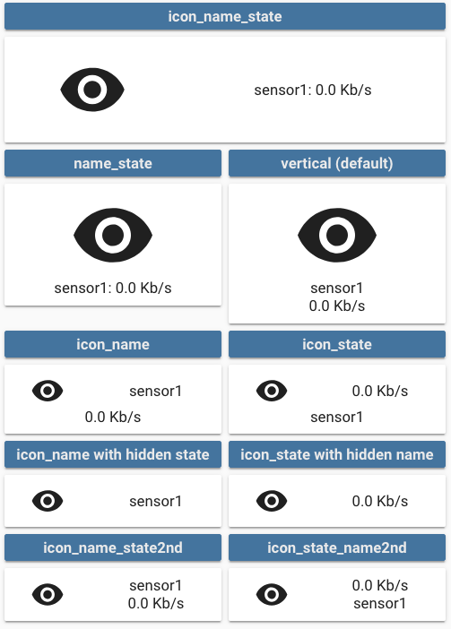

This option enables you to modify the layout of the card.

It is fully compatible with every `show_*` option. Make sure you set `show_state: true` if you want to show the state

Multiple values are possible, see the image below for examples:

- `vertical` (default value if nothing is provided): Everything is centered vertically on top of each other
- `icon_name_state`: Everything is aligned horizontally, name and state are concatenated, label is centered below
- `name_state`: Icon sits on top of name and state concatenated on one line, label below
- `icon_name`: Icon and name are horizontally aligned, state and label are centered below
- `icon_state`: Icon and state are horizontally aligned, name and label are centered below
- `icon_label`: Icon and label are horizontally aligned, name and state are centered below
- `icon_name_state2nd`: Icon, name and state are horizontally aligned, name is above state, label below name and state
- `icon_state_name2nd`: Icon, name and state are horizontally aligned, state is above name, label below name and state

