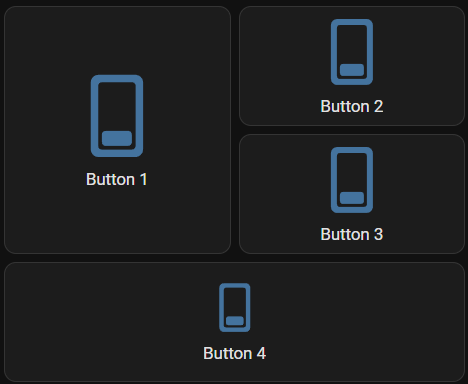

You can use this card in [sections views](https://www.home-assistant.io/dashboards/sections/) (the default in home assistant since early 2024).

To enable compatibility with sections (meaning the card adjusts its size automatically and aligns with the other cards), you need to add `section_mode: true` to the configuration of your card. This will set the CSS card height to 100% and allow modification of its size using the default `grid_options` available with all cards used in sections.

For users with heavily modified cards using `styles`, you might need to adjust your configuration once enabling `section_mode`.

!!! info

    While `section_mode` is enabled: using `aspect_ratio` or setting the card's `height` or `width` using CSS will probably break the layout and is considered incompatible.

    There might be other incompatible options, if you find any, please update this documentation by submitting a PR.



```yaml
views:
  - title: Grid
    type: sections
    sections:
      - type: grid
        cards:
          - type: custom:button-card
            entity: switch.skylight
            name: Button 1
            section_mode: true
            grid_options:
              rows: 4
              columns: 6
          - type: custom:button-card
            entity: switch.skylight
            name: Button 2
            section_mode: true
            grid_options:
              rows: 2
              columns: 6
          - type: custom:button-card
            entity: switch.skylight
            name: Button 3
            section_mode: true
            grid_options:
              rows: 2
              columns: 6
          - type: custom:button-card
            entity: switch.skylight
            name: Button 4
            section_mode: true
            grid_options:
              rows: 2
              columns: 12
```
