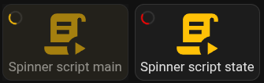

A spinner can be enabled on the card to give some feedback to the user. Eg: display the spinner while a script is running.

By default, the spinner will overlay the whole card and disable actions while active.

Multiple CSS variables are also available for its configuration and you can configure it using the `spinner` entry in `styles`.

| Variable | Default | Description |
| --- | --- | --- |
| `--button-card-spinner-color` | Follows `color` of button card | Color of the spinner |
| `--button-card-spinner-size` | `1.5vw` | The size of the spinner (it's a "font", so percentages are not accepted here) |
| `--button-card-spinner-background-opacity` | `0.4` | The opacity of the overlay which sits on top of the card. |
| `--button-card-spinner-background-color` | `--card-background-color` or white if undefined | The color of the overlay mask |

Some examples:



- Spinner displayed while a script is running, actions are locked

      ```yaml
      type: 'custom:button-card'
      entity: script.delay_script
      name: Spinner script main
      tap_action:
        action: perform-action
        perform_action: script.delay_script
      show_label: state
      spinner: '[[[ return entity.state === "on" ]]]'
      ```

- Spinner displayed in `red` while a script is running using `state`, interactions are unlocked and overlay color is disabled.

      ```yaml
      type: 'custom:button-card'
      entity: script.delay_script
      name: Spinner script state
      tap_action:
        action: perform-action
        perform_action: script.delay_script
      show_label: state
      state:
        - value: 'on'
          spinner: true
          styles:
            spinner:
              - pointer-events: none !important # this unlocks the overlay
              - --button-card-spinner-color: red
              - --button-card-spinner-background-color: none
      ```
