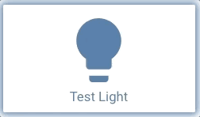
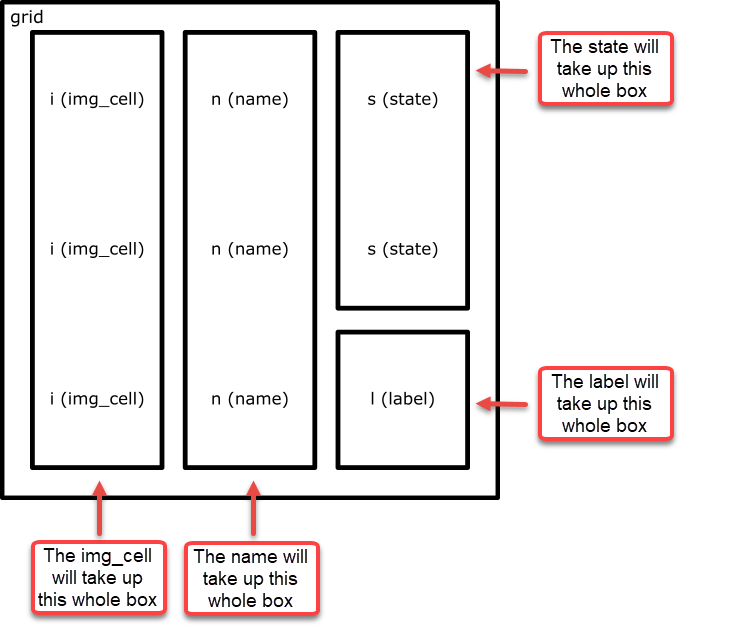

All the styles entries, support [JS Templates](./js-templates.md), see [here](./custom-fields.md) for some examples.

## Easy styling options

For each element in the card, styles can be defined in 2 places:

- in the main part of the config
- in each state

Styles defined in each state are **additive** with the ones defined in the main part of the config. In the `state` part, just define the ones specific to your current state and keep the common ones in the main part of the config.

The `style` object members are:

- `card`: styles for the card itself. Styles that are defined here will be applied to the whole card and its content, unless redefined in elements below.
- `icon`: styles for the icon
- `entity_picture`: styles for the picture (if any)
- `name`: styles for the name
- `state`: styles for the state
- `label`: styles for the label
- `lock`: styles for the lock icon (see [here](https://github.com/custom-cards/button-card/blob/master/src/styles.ts#L73-L86) for the default style)
- `tooltip`: styles for the tooltip (see [Tooltip styles](../config/tooltip.md#tooltip-styles))
- `spinner`: styles for the spinner overlay
- `custom_fields`: styles for each of your custom fields. See [Custom Fields](./custom-fields.md)

```yaml
type: custom:button-card
[...]
styles:
  card:
    - xxxx: value
  icon:
    - xxxx: value
  entity_picture:
    - xxxx: value
  name:
    - xxxx: value
  state:
    - xxxx: value
  label:
    - xxxx: value
state:
  - value: 'on'
    styles:
      card:
        - yyyy: value
      icon:
        - yyyy: value
      entity_picture:
        - yyyy: value
      name:
        - yyyy: value
      state:
        - yyyy: value
      label:
        - yyyy: value
```

This will render:

- The `card` with the styles `xxxx: value` **and** `yyyy: value` applied
- Same for all the others.

See [styling](../examples/styling.md) for a complete example.

## Light entity color variable

If a light entity is assigned to the button, then:

- the CSS variable `--button-card-light-color` will contain the current light color
- the CSS variable `--button-card-light-color-no-temperature` will contain the current light without the temperature

You can use them both in other parts of the button. When off, it will be set to `var(--paper-item-icon-color)`



```yaml
styles:
  name:
    - color: var(--button-card-light-color)
  card:
    - -webkit-box-shadow: 0px 0px 9px 3px var(--button-card-light-color)
    - box-shadow: 0px 0px 9px 3px var(--button-card-light-color)
```

## Advanced styling options

For advanced styling, there are 2 other options in the `styles` config object:

- `grid`: mainly layout for the grid
- `img_cell`: mainly how you position your icon in its cell

This is how the button is constructed (HTML elements):


The `grid` element uses CSS grids to design the layout of the card:

- `img_cell` element is going to the `grid-area: i` by default
- `name` element is going to the `grid-area: n` by default
- `state` element is going to the `grid-area: s` by default
- `label` element is going to the `grid-area: l` by default

You can see how the default layouts are constructed [here](https://github.com/custom-cards/button-card/blob/master/src/styles.ts#L248) and inspire yourself with it. We'll not support advanced layout questions here, please use [Home Assistant's community forum][forum] for that.

To learn more, please use Google and this [excellent guide about CSS Grids](https://css-tricks.com/snippets/css/complete-guide-grid/).

For a quick overview on the grid-template-areas attribute, the following example should get you started:

```yaml
- grid-template-areas: '"i n s" "i n s" "i n l"'
```

If we take the value and orient it into rows and columns, you begin to see the end result.

```
"i n s"
"i n s"
"i n l"
```

The end product will results in the following grid layout



Some examples:

- label on top:

      ```yaml
      styles:
        grid:
          - grid-template-areas: '"l" "i" "n" "s"'
          - grid-template-rows: min-content 1fr min-content min-content
          - grid-template-columns: 1fr
      ```

- icon on the right side (by overloading an existing layout):

      ```yaml
      type: 'custom:button-card'
      entity: sensor.sensor1
      layout: icon_state_name2nd
      show_state: true
      show_name: true
      show_label: true
      label: label
      styles:
        grid:
          - grid-template-areas: '"n i" "s i" "l i"'
          - grid-template-columns: 1fr 40%
      ```

- Apple Homekit-like buttons:

      

      ```yaml
      type: custom:button-card
      entity: switch.skylight
      name: <3 Apple
      icon: mdi:fire
      show_state: true
      styles:
        card:
          - width: 100px
          - height: 100px
        grid:
          - grid-template-areas: '"i" "n" "s"'
          - grid-template-columns: 1fr
          - grid-template-rows: 1fr min-content min-content
        img_cell:
          - align-self: start
          - text-align: start
        name:
          - justify-self: start
          - padding-left: 10px
          - font-weight: bold
          - text-transform: lowercase
        state:
          - justify-self: start
          - padding-left: 10px
      state:
        - value: 'off'
          styles:
            card:
              - filter: opacity(50%)
            icon:
              - filter: grayscale(100%)
      ```

## Injecting CSS with `extra_styles`

**Note**: `extra_styles` **MUST NOT** be used on the first button-card of the current view, else it will be applied to all the cards in all Lovelace. **It is not possible to fix this behaviour.**

You can inject any CSS style you want using this config option. It is useful if you want to inject CSS animations for example. This field supports [JS Templates](../advanced/js-templates.md).

An example is better than words:


```yaml
type: custom:button-card
name: Change Background
aspect_ratio: 2/1
extra_styles: |
  @keyframes bgswap1 {
    0% {
      background-image: url("/local/background1.jpg");
    }
    25% {
      background-image: url("/local/background1.jpg");
    }
    50% {
      background-image: url("/local/background2.jpg");
    }
    75% {
      background-image: url("/local/background2.jpg");
    }
    100% {
      background-image: url("/local/background1.jpg");
    }
  }
styles:
  card:
    - animation: bgswap1 10s linear infinite
    - background-size: cover
  name:
    - color: white
```
