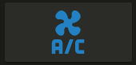

Show a button for the air conditioner (blue when on, `var(--disabled-text-color)` when off):



```yaml
type: 'custom:button-card'
entity: switch.ac
icon: mdi:air-conditioner
color: rgb(28, 128, 199)
```

Redefine the color when the state if off to red:

```yaml
type: 'custom:button-card'
entity: switch.ac
icon: mdi:air-conditioner
color: rgb(28, 128, 199)
state:
  - value: 'off'
    color: rgb(255, 0, 0)
```

---

Show an ON/OFF button for the home_lights group:


```yaml
type: 'custom:button-card'
entity: group.home_lights
show_icon: false
show_state: true
```

---

Light entity with custom icon and "more info" pop-in:


```yaml
type: 'custom:button-card'
entity: light.living_room_lights
icon: mdi:sofa
color: auto
tap_action:
  action: more-info
```

---

Light card with card color type, name, and automatic color:


```yaml
type: 'custom:button-card'
entity: light._
icon: mdi:home
color: auto
color_type: card
tap_action:
  action: more-info
name: Home
styles:
  card:
    - font-size: 12px
    - font-weight: bold
```

---

Horizontal stack with :

- 2x blank cards
- 1x volume up button with service call
- 1x volume down button with service call
- 2x blank cards


```yaml
type: horizontal-stack
cards:
  - type: 'custom:button-card'
    color_type: blank-card
  - type: 'custom:button-card'
    color_type: blank-card
  - type: 'custom:button-card'
    color_type: card
    color: rgb(223, 255, 97)
    icon: mdi:volume-plus
    tap_action:
      action: call-service
      service: media_player.volume_up
      data:
        entity_id: media_player.living_room_speaker
  - type: 'custom:button-card'
    color_type: card
    color: rgb(223, 255, 97)
    icon: mdi:volume-minus
    tap_action:
      action: call-service
      service: media_player.volume_down
      data:
        entity_id: media_player.living_room_speaker
  - type: 'custom:button-card'
    color_type: blank-card
  - type: 'custom:button-card'
    color_type: blank-card
```

---

Vertical Stack with :

- 1x label card
- Horizontal Stack with :
  - 1x Scene 1 Button
  - 1x Scene 2 Button
  - 1x Scene 3 Button
  - 1x Scene 4 Button
  - 1x Scene Off Button


```yaml
type: vertical-stack
cards:
  - type: 'custom:button-card'
    color_type: label-card
    color: rgb(44, 109, 214)
    name: Kitchen
  - type: horizontal-stack
    cards:
      - type: 'custom:button-card'
        entity: switch.kitchen_scene_1
        color_type: card
        color: rgb(66, 134, 244)
        icon: mdi:numeric-1-box-outline
      - type: 'custom:button-card'
        entity: switch.kitchen_scene_2
        color_type: card
        color: rgb(66, 134, 244)
        icon: mdi:numeric-2-box-outline
      - type: 'custom:button-card'
        entity: switch.kitchen_scene_3
        color_type: card
        color: rgb(66, 134, 244)
        icon: mdi:numeric-3-box-outline
      - type: 'custom:button-card'
        entity: switch.kitchen_scene_4
        color_type: card
        color: rgb(66, 134, 244)
        icon: mdi:numeric-4-box-outline
      - type: 'custom:button-card'
        entity: switch.kitchen_off
        color_type: card
        color: rgb(66, 134, 244)
        icon: mdi:eye-off-outline
```
