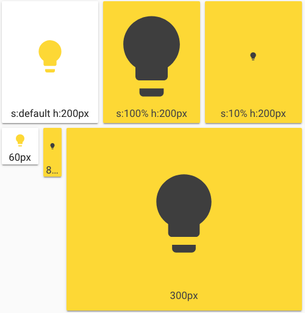

Through the `styles` you can specify the `width` and `height` of the card, and also the icon size through the main `size` option. Playing with icon size will growth the card unless a `height` is specified.

If you specify a width for the card, it has to be in `px`. All the cards without a `width` defined will use the remaining space on the line.



```yaml
- type: horizontal-stack
  cards:
    - type: 'custom:button-card'
      entity: light.test_light
      color: auto
      name: s:default h:200px
      styles:
        card:
          - height: 200px
    - type: 'custom:button-card'
      entity: light.test_light
      color_type: card
      color: auto
      name: s:100% h:200px
      size: 100%
      styles:
        card:
          - height: 200px
    - type: 'custom:button-card'
      entity: light.test_light
      color_type: card
      color: auto
      size: 10%
      name: s:10% h:200px
      styles:
        card:
          - height: 200px
- type: horizontal-stack
  cards:
    - type: 'custom:button-card'
      entity: light.test_light
      color: auto
      name: 60px
      styles:
        card:
          - height: 60px
          - width: 60px
    - type: 'custom:button-card'
      entity: light.test_light
      color_type: card
      color: auto
      name: 80px
      styles:
        card:
          - height: 80px
          - width: 30px
    - type: 'custom:button-card'
      entity: light.test_light
      color_type: card
      color: auto
      name: 300px
      styles:
        card:
          - height: 300px
```
