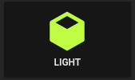

Input select card with select next service and custom color and icon for states. In the example below the icon `mdi:cube-outline` will be used when value is `sleeping` and `mdi:cube` in other cases.



#### Default behavior

If you don't specify any operator, `==` will be used to match the current state against the `value`

```yaml
- type: 'custom:button-card'
  entity: input_select.cube_mode
  icon: mdi:cube
  tap_action:
    action: call-service
    service: input_select.select_next
    data:
      entity_id: input_select.cube_mode
  show_state: true
  state:
    - value: 'sleeping'
      color: var(--disabled-text-color)
      icon: mdi:cube-outline
    - value: 'media'
      color: rgb(5, 147, 255)
    - value: 'light'
      color: rgb(189, 255, 5)
```

#### With Operator on state

The definition order matters, the first item to match will be the one selected.

```yaml
- type: "custom:button-card"
  entity: sensor.temperature
  show_state: true
  state:
    - value: 15
      operator: '<='
      color: blue
      icon: mdi:thermometer-minus
    - value: 25
      operator: '>='
      color: red
      icon: mdi:thermometer-plus
    - operator: 'default' # (1)!
      color: yellow
      icon: mdi: thermometer
      styles:
        card:
          - opacity: 0.5
```

1. Used when nothing matches (here any state > 15 and < 25)
