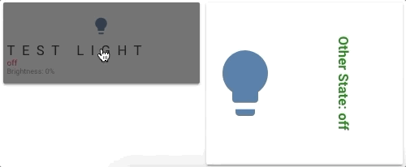

```yaml
type: 'custom:button-card'
color_type: icon
entity: light.test_light
label: |
  [[[
    var bri = states['light.test_light'].attributes.brightness;
    return 'Brightness: ' + (bri ? bri : '0') + '%';
  ]]]
show_label: true
show_state: true
size: 10%
styles:
  card:
    - height: 100px
  label:
    - color: gray
    - font-size: 9px
    - justify-self: start
    - padding: 0px 5px
  name:
    - text-transform: uppercase
    - letter-spacing: 0.5em
    - font-familly: cursive
    - justify-self: start
    - padding: 0px 5px
  state:
    - justify-self: start
    - font-size: 10px
    - padding: 0px 5px
state:
  - value: 'on'
    styles:
      state:
        - color: green
  - value: 'off'
    styles:
      state:
        - color: red
      card:
        - filter: brightness(40%)
```

```yaml
type: 'custom:button-card'
color_type: icon
entity: light.test_light
layout: icon_label
label: |
  [[[ return 'Other State: ' + states['switch.skylight'].state; ]]]
show_label: true
show_name: false
size: 100%
styles:
  card:
    - height: 200px
  label:
    - font-weight: bold
    - writing-mode: vertical-rl
    - text-orientation: mixed
state:
  - value: 'on'
    styles:
      label:
        - color: red
  - value: 'off'
    styles:
      label:
        - color: green
```
